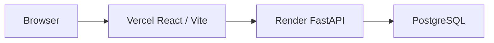

# FPK-EXPRESS

Plateforme de précommande et retrait direct pour les étudiants de la FPK Khouribga.

FPK-EXPRESS met en relation les étudiants avec des snacks partenaires autour du campus. L'étudiant commande avant sa pause, le partenaire prépare le repas, puis la commande est récupérée directement au snack. **Le produit ne propose aucune livraison et le seul paiement actif est le paiement au retrait.**

[Consulter le dossier entrepreneurial](https://anabkl.github.io/fpk-express-startup-case/)

## Validation du problème

- 23 étudiants ont répondu à l'enquête terrain.
- Plus de 81 % attendent au moins 15 minutes.
- Environ 95 % sautent parfois un repas ou mangent mal pour éviter un retard.
- 100 % se déclarent intéressés par la précommande.
- 66,7 % accepteraient des frais de service de 1 à 2 MAD.

## Capacités actuelles

- Landing page publique, aperçu limité du menu et lien vers le dossier entrepreneurial.
- Inscription publique réservée aux étudiants, connexion sécurisée étudiant/vendeur et déconnexion.
- Mots de passe hachés avec Argon2 et jetons d'accès signés stockés dans `sessionStorage`.
- Catalogue réel avec recherche, catégories, disponibilité, stock et snack partenaire.
- Précommande persistée, référence de retrait, estimation opérationnelle et historique personnel.
- Parcours vendeur limité à son snack: menu, disponibilité, commandes, statuts et analyses réelles.
- Cycle de commande `Pending -> Preparing -> Ready -> Collected`, avec annulation contrôlée.
- Paiement actif uniquement `PayOnPickup`, puis confirmation `PaidOnPickup` après le retrait.
- Suggestions et tendances honnêtement basées sur des règles opérationnelles et les données disponibles.
- Thème clair/sombre, navigation mobile, animations sobres, skeletons et états d'erreur.

FPK-EXPRESS ne prépare pas les repas, ne possède pas le stock des snacks, ne livre pas et ne conserve aucun argent.

## Architecture



```text
frontend/                 React, Vite, TailwindCSS, Framer Motion, Recharts
backend/app/              FastAPI, SQLAlchemy, Pydantic, auth and business rules
backend/alembic/          Versioned database migrations
backend/tests/            API, authorization and workflow tests
docs/                     Deployment, security, roadmap and contribution guides
.github/workflows/        Continuous integration
docker-compose.yml        Production-style local containers
```

SQLite is used locally. PostgreSQL is supported in production through `DATABASE_URL` with the Psycopg driver.

## API overview

| Method | Endpoint | Access | Purpose |
| --- | --- | --- | --- |
| `GET` | `/health` | Public | Service health |
| `POST` | `/auth/register` | Public | Create a student account |
| `POST` | `/auth/login` | Public | Login student or seeded vendor |
| `GET` | `/auth/me` | Authenticated | Current user |
| `GET` | `/partners` | Public | Partner snack previews |
| `GET` | `/meals`, `/meals/{id}` | Public | Available menu |
| `POST/PATCH/DELETE` | `/meals...` | Vendor | Manage owned meals |
| `POST` | `/orders` | Student | Create a persisted preorder |
| `GET` | `/orders` | Student | Own order history only |
| `POST` | `/orders/{id}/cancel` | Student | Cancel an own pending order |
| `GET` | `/vendor/orders` | Vendor | Orders for the owned snack only |
| `PATCH` | `/orders/{id}/status` | Vendor | Apply the next valid workflow state |
| `PATCH` | `/orders/{id}/payment` | Vendor | Mark a collected order paid on pickup |
| `GET` | `/dashboard/stats` | Vendor | Vendor-scoped operational metrics |
| `GET` | `/ai/recommendations` | Public | Rule-based meal suggestions |
| `GET` | `/ai/peak-hours` | Public | Trends from available order history |

Interactive API documentation is available at `http://localhost:8000/docs` locally.

## Environment variables

Copy `.env.example` to `.env` for Docker Compose or export the backend values in your shell. Never commit real secrets.

| Variable | Scope | Description |
| --- | --- | --- |
| `VITE_API_URL` | Frontend build | Public FastAPI base URL |
| `APP_ENV` | Backend | `development`, `test`, or `production` |
| `DATABASE_URL` | Backend | SQLite or PostgreSQL connection URL |
| `ALLOWED_ORIGINS` | Backend | Comma-separated exact frontend origins |
| `JWT_SECRET` | Backend | Strong random signing secret, at least 32 characters in production |
| `ACCESS_TOKEN_EXPIRE_MINUTES` | Backend | Access-token lifetime; default `480` |
| `DEMO_VENDOR_EMAIL` | Backend | Seeded vendor email; optional locally |
| `DEMO_VENDOR_PASSWORD` | Backend | Strong seeded vendor password |
| `RATE_LIMIT_REQUESTS` | Backend | Requests allowed per process/IP window |
| `RATE_LIMIT_WINDOW_SECONDS` | Backend | Rate-limit window duration |

Vendor registration is never public. A vendor account is seeded only when valid `DEMO_VENDOR_EMAIL` and `DEMO_VENDOR_PASSWORD` values are supplied to the backend.

## Local setup on macOS

### Backend

```bash
cd backend
python3 -m venv .venv
source .venv/bin/activate
pip install -r requirements.txt
alembic -c alembic.ini upgrade head
uvicorn app.main:app --reload --port 8000
```

### Frontend

In a second terminal:

```bash
cd frontend
npm ci
npm run dev
```

- Frontend: `http://localhost:5173`
- Backend: `http://localhost:8000`
- API docs: `http://localhost:8000/docs`

To enable the local vendor account, export non-placeholder `DEMO_VENDOR_EMAIL` and `DEMO_VENDOR_PASSWORD` values before the migration/start command.

## Database migrations

```bash
cd backend
source .venv/bin/activate
alembic -c alembic.ini upgrade head
alembic -c alembic.ini current
```

The first migration creates the live schema. When it detects the legacy demo tables, it preserves catalogue meals, creates partner ownership fields, and removes fabricated historical orders rather than migrating them as real activity.

## Docker Compose

```bash
cp .env.example .env
# Replace JWT_SECRET and vendor placeholders in .env.
docker compose up --build
```

The frontend image uses `npm ci`, creates a production Vite bundle, and serves it through Nginx at `http://localhost:5173`. The backend container runs Alembic before Uvicorn.

## Tests and verification

```bash
cd backend
source .venv/bin/activate
pytest
```

```bash
cd frontend
npm ci
npm run build
```

```bash
PYTHONPYCACHEPREFIX=/tmp/fpk-express-pycache python3 -m py_compile backend/app/*.py
docker compose config
git diff --check
```

CI runs the backend tests, Python compile check, frontend clean install/build, Compose validation and whitespace check on every push and pull request.

## Security model

- Backend authorization enforces student ownership and vendor snack ownership on every protected route.
- Passwords use Argon2; signed access tokens expire and never expose `JWT_SECRET` to the frontend.
- Pydantic validates identities, meal data, quantities, pickup times, stock, statuses and payment transitions.
- Security headers, exact-origin CORS, response-time logging and an in-memory IP limiter remain enabled.
- Logs contain method, path, status and duration only.

This remains MVP authentication: bearer tokens live in `sessionStorage`, there is no password reset or account verification, and the process-local rate limiter is not distributed. See [docs/SECURITY.md](docs/SECURITY.md).

## API performance

Public menu, suggestions and peak-hour reads use a lightweight process-local TTL cache. Menu, stock, order and partner changes invalidate cached reads. Scoped student/vendor data is always loaded with authorization and is not shared through the public cache.

## Mobile-first UX & loading states

The approved interface keeps its responsive hamburger navigation, dark mode and compact dashboard layouts. Skeleton loaders cover the menu, student/vendor dashboard cards and insights so network activity does not shift the layout.

## Resilience, feedback and validation

Failed production writes show a French error and never create a fake order, meal or status update. Form values remain available for correction/retry. Development may display clearly labelled local catalogue data when the API is offline, but ordering still requires the real backend. Toasts confirm successful authentication and persisted operations.

## Animation polish

Landing sections, meal cards, dashboard cards and insight panels retain short Framer Motion reveals and subtle hover feedback. Motion does not change the approved layout or block interaction.

## Screenshots

The documentation is ready for final deployment captures:

| Surface | Target file |
| --- | --- |
| Landing page | `screenshots/landing-page.png` |
| Student dashboard | `screenshots/student-dashboard.png` |
| Vendor dashboard | `screenshots/vendor-dashboard.png` |
| Smart insights | `screenshots/ai-insights.png` |
| FastAPI docs | `screenshots/api-docs.png` |

## Demo flow

1. Open the public landing page and the entrepreneurship dossier.
2. Register a student account, filter meals and create a preorder.
3. Show the reference, payment-on-pickup state and personal order history.
4. Log out, then log in with the privately supplied vendor account.
5. Move the order from En attente to En préparation, Prête and Récupérée.
6. Mark it Payé au retrait and show the real vendor analytics.

## Why this is not just a school project

- The problem and willingness to use/pay were validated with real FPK students.
- Real accounts, persisted orders and server-side ownership replace browser-only role simulation.
- The business model is an intermediary service, with clear responsibility boundaries for partner snacks.
- Operational suggestions are transparent about their rule-based MVP method.
- React/Vite, FastAPI, Alembic, PostgreSQL support, CI and containers form a scalable deployment base.

## Deployment

The intended path is Vercel for the frontend, Render for FastAPI and Render PostgreSQL or Neon for the database. Follow [docs/DEPLOYMENT.md](docs/DEPLOYMENT.md) for the two-stage origin setup, migrations, exact configuration and smoke checks.

No deployment is claimed in this repository until a real public frontend URL, backend URL and production smoke test are confirmed.

## Honest limitations and roadmap

- No delivery, cart combining multiple snacks, push notification, password reset or platform admin console.
- A preorder currently contains one meal type from one snack partner.
- In-memory cache and rate limiting reset per backend process.
- Operational estimates are rules/trends, not a trained or evaluated machine-learning model.
- Legal, partner and operating procedures still require validation before broader campus rollout.

**Future payment disclaimer:** `FPK Wallet — Bientôt disponible` is informational only. No wallet, MT Cash, WhatsApp top-up, QR payment, card processing, deposit, withdrawal or money storage is active. A future payment feature would require legal validation and an official partnership with an authorized payment provider.
